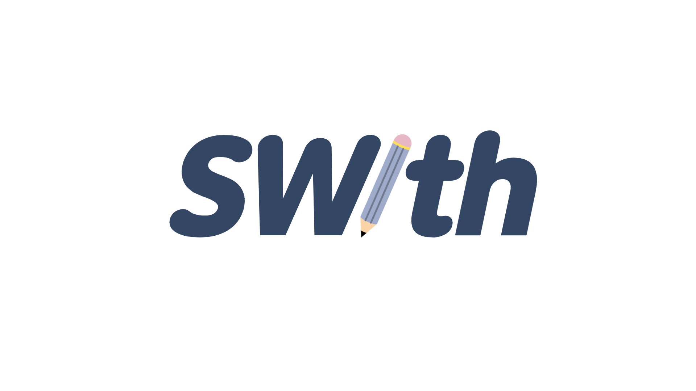
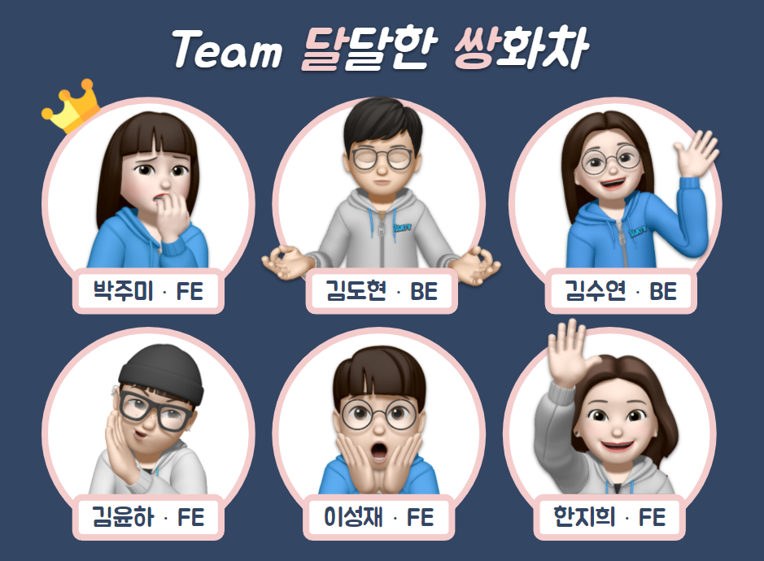
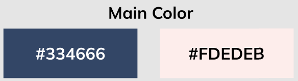
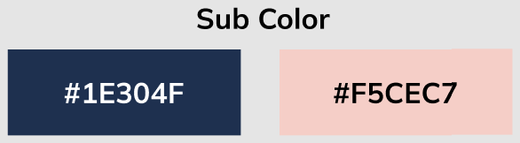
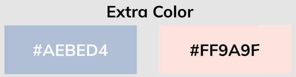
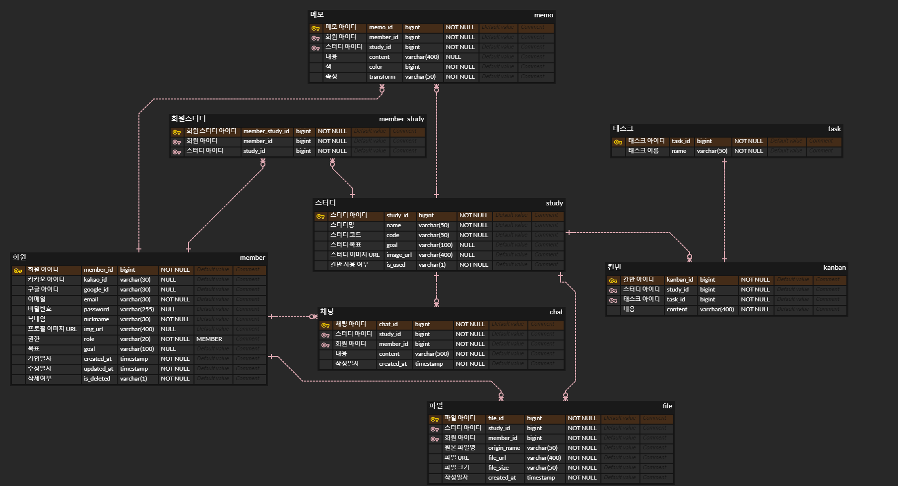
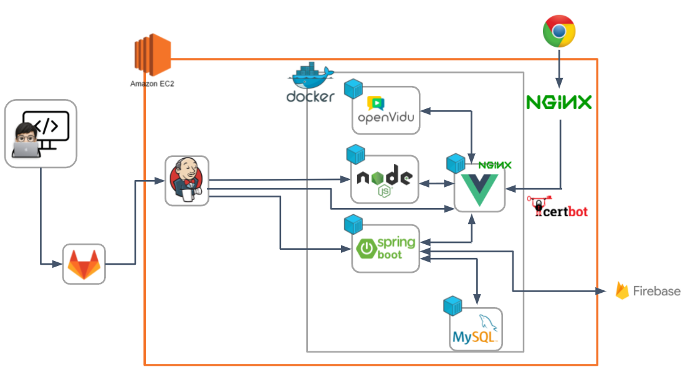

# SWith(스윗)



------

**Study With ___?**

> 비대면으로 스터디를 진행하는 사용자에게 하나의 웹 화면에서 다양한 기능을 제공하는 화상 스터디 플랫폼
>
> 오프라인 같은 현장감에서 공동 학습할 수 있는 환경 제공

## 프로젝트 목차

------

## 1) 프로젝트 소개 📢

1. 기간 : 2022/01/04 ~ 2022/02/18 (총 7주)
2. 팀원 (6인)
   - 박주미 : 팀장, Front-end
   - 김도현 : Back-end, Infra, Front-end
   - 김수연 : Back-end, Front-end
   - 김윤하 : Front-end
   - 이성재 : Front-end
   - 한지희 : Front-end



### 기술 스택

- **이슈 관리**
  - Jira
- **형상 관리**
  - Gitlab
- **와이어 프레임 관리**
  - Figma
- **ERD 관리**
  - ERD Cloud
- **커뮤니케이션 관리**
  - Mattermost
  - Notion
  - Google 스프레드시트
  - Google 프레젠테이션
- **IDE**
  - Visual Studio Code
  - IntelliJ IDEA Community
- **Front-end**
  - Vue.js
  - Vue Router
  - Vuex
  - vuedraggable ( 칸반보드 구현 )
  - vue3-moveable ( 메모 구현 )
  - axios
  - bootstrap
  - fabric.js ( 화이트보드 구현 )
  - animate.css ( CSS 애니메이션 )
  - mosha-vue-toastify ( 토스트 알림 )
  - font awesome ( 아이콘 )
- **Back-end**
  - Spring Boot
  - Spring Security
  - Spring Data JPA
  - QueryDSL
  - lombok
  - JWT
- **WebRTC**
  - OpenVidu
- **Chatting**
  - STOMP
- **Whiteboard**
  - Socket.io
- **Database**
  - MySQL
  - Firebase
- **Server**
  - AWS EC2
- **DevOps**
  - Docker
  - Jenkins

### 디자인

- **Main color**



- **Sub color**



- **Extra color**



- **Meaning of Color**

  Pink : 따뜻함, 달콤함, 편안함 ( 함께 하기에 좋은 )

  Navy : 진실, 책임감 ( 맡은 바에 최선을 다하는 )

- **Logo**


- **Font**
  - 한글 : Noto Sans KR
  - 영어 : Mulish

## 2) 프로젝트 파일 구조 🛠️

### Front-end

```
├─public
└─src
    ├─api
    │  └─common
    ├─assets
    │  └─img
    │      ├─error_page
    │      ├─icon_logo
    │      ├─icon_oauth_google
    │      ├─icon_oauth_kakao
    │      ├─icon_sidebar
    │      │  └─file
    │      ├─icon_study_page
    │      ├─landing
    │      ├─main
    │      ├─member
    │      ├─navbar
    │      └─study_room
    ├─composables
    ├─router
    ├─store
    │  └─modules
    └─views
        ├─common
        ├─main
        │  └─components
        ├─members
        │  └─components
        └─studies
            └─components
                ├─control
                ├─detail
                ├─room
                │  └─video
                ├─screen
                └─sidebar
```

### Back-end

```
├─.gradle
│  ├─7.3.2
│  │  ├─checksums
│  │  ├─dependencies-accessors
│  │  ├─executionHistory
│  │  ├─fileChanges
│  │  ├─fileHashes
│  │  └─vcsMetadata
│  ├─buildOutputCleanup
│  └─vcs-1
├─.idea
├─build
│  ├─classes
│  │  └─java
│  │      └─main
│  │          └─com
│  │              └─swith
│  │                  ├─api
│  │                  │  ├─controller
│  │                  │  ├─dto
│  │                  │  │  ├─member
│  │                  │  │  │  ├─request
│  │                  │  │  │  └─response
│  │                  │  │  └─study
│  │                  │  │      ├─request
│  │                  │  │      └─response
│  │                  │  └─service
│  │                  ├─common
│  │                  │  ├─jwt
│  │                  │  ├─response
│  │                  │  └─util
│  │                  ├─config
│  │                  └─db
│  │                      ├─entity
│  │                      └─repository
│  ├─generated
│  │  ├─querydsl
│  │  │  ├─com
│  │  │  │  └─swith
│  │  │  │      ├─api
│  │  │  │      │  └─dto
│  │  │  │      │      └─study
│  │  │  │      │          └─response
│  │  │  │      └─db
│  │  │  │          └─entity
│  │  │  └─generated
│  │  └─sources
│  │      ├─annotationProcessor
│  │      │  └─java
│  │      │      └─main
│  │      └─headers
│  │          └─java
│  │              └─main
│  ├─resources
│  │  └─main
│  └─tmp
│      ├─compileJava
│      └─compileQuerydsl
├─gradle
│  └─wrapper
├─out
│  └─production
│      ├─classes
│      └─resources
└─src
    ├─main
    │  ├─java
    │  │  └─com
    │  │      └─swith
    │  │          ├─api
    │  │          │  ├─controller
    │  │          │  ├─dto
    │  │          │  │  ├─member
    │  │          │  │  │  ├─request
    │  │          │  │  │  └─response
    │  │          │  │  └─study
    │  │          │  │      ├─request
    │  │          │  │      └─response
    │  │          │  └─service
    │  │          ├─common
    │  │          │  ├─jwt
    │  │          │  ├─response
    │  │          │  └─util
    │  │          ├─config
    │  │          └─db
    │  │              ├─entity
    │  │              └─repository
    │  └─resources
    └─test
        └─java
            └─com
                └─swith
```

## 3) 프로젝트 산출물 📒

### 와이어 프레임


### ERD



### API Docs

https://docs.google.com/spreadsheets/d/1qUr4OxT4DYXSJidCgBx_LSVlqT9DMXETPDHYqOv9KYs/edit?usp=sharing

### 서비스 아키텍처



### 트러블 슈팅

- **Firebase 파일 업로드/다운로드 기능 구현**
  - Firebase SDK 사용을 위한 key와 환경 변수 값이 포함된 JSON 파일을 서버에서 읽어야 하나 배포를 위한 프로젝트 빌드 시 디렉토리 구조가 달라져 파일을 못 읽어오는 문제 → JSON 파일의 값들을 application.properties에 저장하고 configuration class를 생성, Firebase 서비스를 사용하기 위해 storage 객체를 반환하는 메소드를 갖는 util class를 생성
  - 파일 업로드 시 위변조된 파일의 MIME-Type을 식별하는 문제 → Apache Tika 라이브러리를 사용하여 파일의 실제 MIME-Type을 확인
- **Socket.io를 이용한 화이트보드 기능 구현**
  - 화이트보드 컴포넌트의 mount 훅에서 socket이 연결되어 하나의 사용자에게 여러 socket이 연결되고 브라우저의 동작이 느려지는 문제 → 컴포넌트의 unmount 훅에서 socket의 연결을 해제하여 화이트보드 사용 시에만 socket이 연결되도록 구현
- **칸반 보드 구현 클라이언트-서버 간 주고받을 데이터 형식에 대한 고민**
  - 클라이언트에서 사용해야 하는 데이터 형식과 서버에서 DB에 저장해야 하는 데이터 형식에 큰 차이가 있었기 때문에 커뮤니케이션을 통해 원활한 통신이 이루어질 수 있도록 데이터 형식을 구조화 함

## 4) 프로젝트 결과물 📁

### 포팅 메뉴얼

- [포팅 매뉴얼](./exec/공통PJT_서울_5반_A501_포팅매뉴얼.pdf)

### 시연 시나리오

- [시연 시나리오](./exec/공통PJT_서울_5반_A501_시연시나리오.pdf)